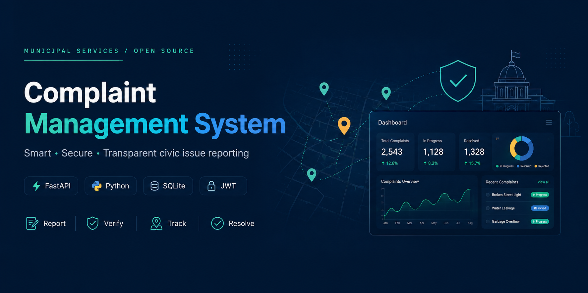

<div align="center">
<p align="center">
  
</p>

## 🏛️ Complaint Management System

## Smart • Secure • Transparent Civic Issue Reporting Platform

Report. Verify. Track. Resolve.


</div>

---

## 📖 Overview

Complaint Management System is a production-inspired civic issue reporting platform that enables citizens to report public infrastructure problems, upload supporting evidence, and track complaint resolution in real time.

The platform provides secure authentication, AI-assisted complaint categorization, moderation workflows, department assignment, analytics, and complete audit logging.

Designed with scalability, maintainability, and security in mind, the project demonstrates modern backend engineering practices using FastAPI.

---
## 📊 Project Highlights

- ⚡ FastAPI Backend
- 🔐 JWT Authentication
- 🤖 AI-Assisted Categorization
- 📈 Analytics Dashboard
- 🏢 Multi-Role Access Control
- 📷 Secure Evidence Uploads

---

## 📚 Table of Contents

- [✨ Features](#-features)
- [🛠 Tech Stack](#-tech-stack)
- [📂 Project Structure](#-project-structure)
- [🚀 Getting Started](#-getting-started)
- [⚙️ Configuration](#configuration)
- [📸 Screenshots](#screenshots)
- [🗺️ Roadmap](#️-roadmap)
- [📜 License](#-license)


---


## ✨ Features

- 🔐 JWT Authentication
- 👥 Role-Based Access Control
- 📝 Complaint Submission
- 📍 Location-Based Reporting
- 📷 Secure Evidence Uploads
- 🤖 AI Complaint Categorization
- ✅ Complaint Verification Workflow
- 🏢 Department Assignment
- 📊 Analytics Dashboard
- 🏆 Citizen Leaderboard
- 📜 Audit Logging
- 📈 Prometheus Monitoring
- 🚨 Sentry Error Tracking

---

## 🛠 Tech Stack

| Category | Technologies |
|-----------|--------------|
| Backend | FastAPI, SQLAlchemy, Alembic, Pydantic |
| Frontend | HTML, CSS, JavaScript, Leaflet.js |
| Database | SQLite |
| Authentication | JWT |
| Security | bcrypt, CSRF Protection, IDOR Prevention |
| AI | AI-assisted Complaint Categorization |
| Monitoring | Prometheus, Sentry |

---

## 🚀 Getting Started

## Clone the repository

```bash
git clone https://github.com/Dev6174/complaint_system.git

cd complaint_system
```

## Create a virtual environment

```bash
python -m venv .venv
```

## Activate it

Windows

```powershell
.venv\Scripts\Activate.ps1
```

Linux/macOS

```bash
source .venv/bin/activate
```

## Install dependencies

```bash
pip install -r requirements.txt
```

---

## Configuration

Create a `.env` file in the project root.

Example:

```env
DATABASE_URL=sqlite:///./complaint_system.db

SECRET_KEY=your-secret-key
ALGORITHM=HS256
ACCESS_TOKEN_EXPIRE_MINUTES=60

AI_CLASSIFIER_ENDPOINT=https://api.example.com/classify
AI_CLASSIFIER_API_KEY=your-api-key

VERIFICATION_THRESHOLD=5
```

---

## ▶️ Running the Application

Start the development server:

```bash
uvicorn app.main:app --reload
```

The application will be available at:

```
http://127.0.0.1:8000
```

API documentation:

```
http://127.0.0.1:8000/docs
```

---

## 🧪 Running Tests

```bash
pytest
```

The test suite covers authentication, RBAC, complaint APIs, upload security, AI fallback behaviour and verification workflows.

---

## Project Structure

```text
complaint_system/
│
├── app/
│   ├── routers/
│   ├── services/
│   ├── middleware/
│   ├── observability/
│   ├── templates/
│   ├── static/
│   └── main.py
│
├── tests/
├── migrations/
├── uploads/
├── requirements.txt
├── README.md
└── LICENSE
```

---

## 🌐 Live Demo

🚧 Coming Soon

## Screenshots

## 📸 Screenshots

| Dashboard | Complaint Portal |
|-----------|------------------|
|  |  |

| Analytics | API Docs |
|-----------|----------|
|  |  |


---

## 🗺️ Roadmap

## Current

- [x] Authentication
- [x] Complaint Management
- [x] AI Categorization
- [x] Analytics
- [x] Audit Logs

## Planned

- [ ] PostgreSQL
- [ ] Docker
- [ ] Redis
- [ ] Email Notifications
- [ ] Mobile App
- [ ] Real-time Updates

---
## License
This project is licensed under the MIT License. See the `LICENSE` file for details.

---
---

## 📌 Project Status

🚧 **Actively Maintained**

This project is under active development, with ongoing improvements focused on performance, security, and user experience.

Contributions, suggestions, and issue reports are always welcome.

---
